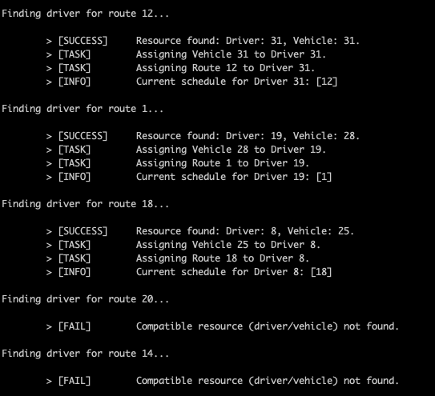
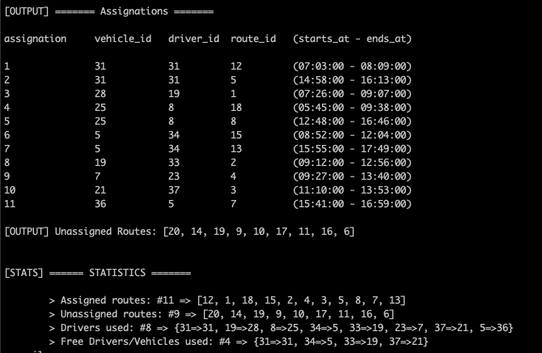

# RoutingUC Test


## Requirements

This RoR application uses the following requirements:

* Ruby 2.6.0

* Rails 5.2.2

* bundler 1.17.3

* psql (PostgreSQL) 11.2

> I used `rvm` to handle Ruby/Rails versions.

To get started, clone this repository to a directory in your machine: 

    $ git clone https://github.com/vjfuenzalida/routinguc-test.git

And then navigate to the app directory:

    $ cd routinguc-test

## Build Steps

First, build the dependencies (gems):

    $ bundle install

Then, setup the database (this will create the DB, load the schema and run the seeds):

    $ rails db:setup

## Using the Scheduler

I built this application in Rails to avoid the manual configuration of a database in postgreSQL and the use of ActiveRecord gem alone (Rails setup this faster). 

My **goal** was **not to build a web application** (handle requests, create views/controllers) so the Scheduler itself can be used from `Rails Console`.

>The Scheduler is defined under app/services/scheduler.rb

To test the scheduler, simply run (in `rails c`) the following:

    s = Scheduler.new
    s.schedule

#### The following information is shown when the algorithm is executing:



#### The output should look like this:




## About the seeds

Seeds were created to test the scheduler with random data, so the Vehicle, Driver, Route and City models are populated with seeds (look at db/seeds.rb).

Initially, 20 routes, 50 drivers, 40 vehicles and 346 cities (based on chilean communes) are created. To change this number, simply modify the following constants (at db/seeds.rb):

```ruby
DRIVER_COUNT = 50
VEHICLE_COUNT = 40
WITHOUT_DRIVER = 10
ROUTE_COUNT = 20
```